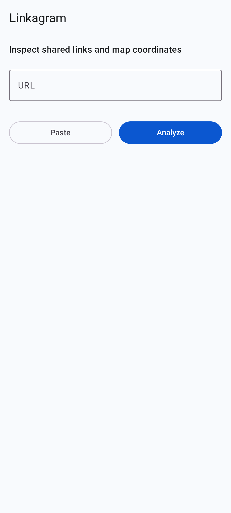
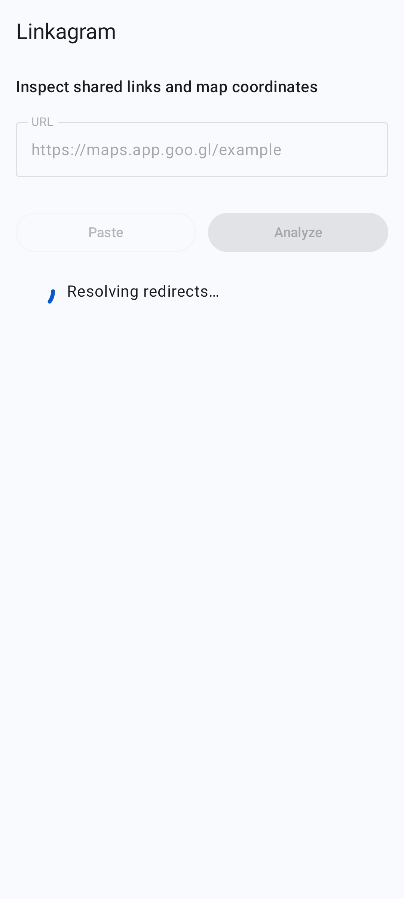
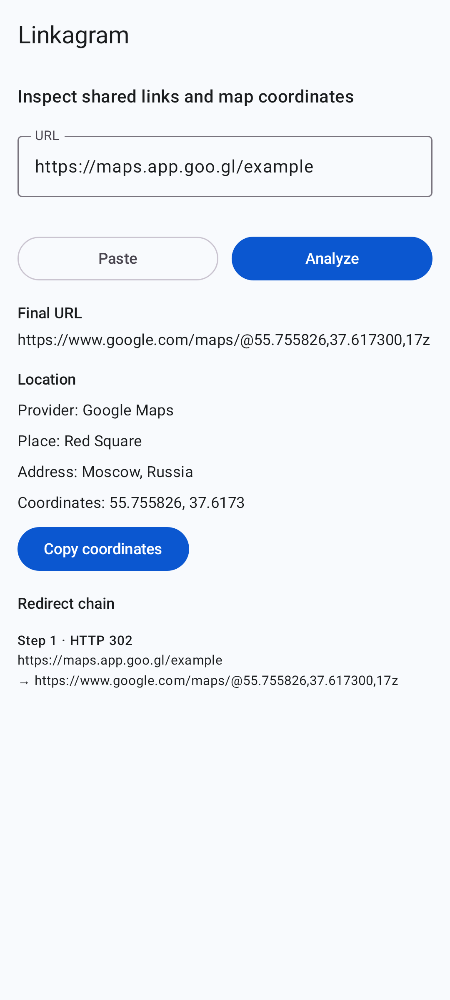
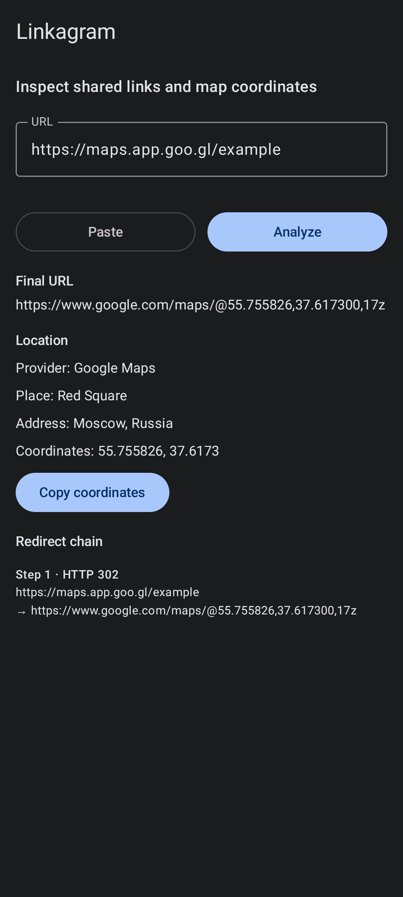
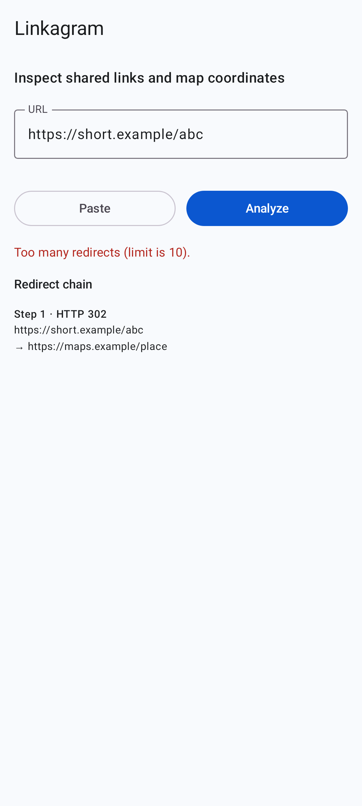

# Linkagram

Android app that resolves shared URLs, traces redirects, and extracts location
metadata and coordinates from map links.

**minSdk 26** (Android 8.0). Debug APK from CI artifacts on every push; release
APKs are published to GitHub Releases when a `v*` tag is pushed.

<p align="center">
  
  
  
  
</p>

<p align="center">
  
  
</p>

## Current status

Runnable Android/Compose app with:

- URL intake from Share (`ACTION_SEND`), VIEW intents, clipboard, and manual input
- URL validation and normalization (Spec 001)
- Manual HTTP redirect resolution with chain display (Spec 002)
- Map URL parsing for Google, Yandex, OSM, Apple, and generic coordinates (Spec 003)
- Result presentation for Spec 004 states (idle, analyzing, errors, location)
- One-tap copy of coordinates as `lat, lon` (Spec 005)
- Host-side Compose preview screenshot tests (ADR-005)
- Unit tests and GitHub Actions CI (`test`, `lint`, `validateDebugScreenshotTest`,
  `assembleDebug`), with screenshot reports and the debug APK uploaded as artifacts
- Release workflow publishing an APK to GitHub Releases on a `v*` tag

Application id / namespace: `io.github.miksask.linkagram`

Minimum Android version 8.0 (API 26); compiled and targeted against API 37.

## Why this project exists

This project is an experiment in AI-assisted software development.

My primary background is Python, web development, and microservices.
Linkagram is built for Android using Kotlin and Jetpack Compose with assistance
from tools such as Claude and Cursor.

The goal is not to claim that AI writes software autonomously. The goal is to
demonstrate a workflow where AI accelerates development while project
constraints, specifications, reviews, tests, and architecture remain explicit.

## Features

- Receive URLs from Android Share sheet and VIEW intents
- Paste URLs from clipboard
- Resolve short links and show redirect hops with status codes
- Detect map links and extract coordinates / available place metadata
- Copy `latitude, longitude` in one tap

## Build and test

Requires JDK 17 and Android SDK platform 37.

```bash
./gradlew test
./gradlew lint
./gradlew validateDebugScreenshotTest
./gradlew assembleDebug
```

Record new screenshot baselines only after intentional UI changes:

```bash
./gradlew updateDebugScreenshotTest
```

Debug APK output:

`app/build/outputs/apk/debug/app-debug.apk`

Contribution setup and conventions: [`CONTRIBUTING.md`](CONTRIBUTING.md).

## Releases

Pushing a `v*` tag runs [`.github/workflows/release.yml`](.github/workflows/release.yml),
which runs the checks, builds the release APK, and attaches it to a GitHub
Release. Signing uses repository secrets when they are configured; without them
the workflow still publishes an unsigned APK, which has to be installed
manually.

## Engineering approach

- Specs: `docs/specs/`
- Architecture: `docs/architecture.md`
- Architecture decisions: `docs/decisions/`
- Phase prompts: `docs/prompts/`
- Documentation index: `docs/README.md`
- AI agent instructions: `AGENTS.md`
- Cursor rules: `.cursor/rules/`
- Agent skills: `.agents/skills/`
- CI: GitHub Actions (unit tests, lint, screenshot validation, debug APK artifact)
- APKs: GitHub Releases

## Cursor / AI workflow

What is verifiable in this repository today:

1. Behaviour is specified in `docs/specs/` before or alongside code.
2. Substantial choices are recorded as ADRs under `docs/decisions/`.
3. Agents follow `AGENTS.md` and skills under `.agents/skills/`.
4. CI gates: `test`, `lint`, `validateDebugScreenshotTest`, `assembleDebug`.
5. Screenshot diffs land as CI artifacts so UI changes can be reviewed as images,
   not only as Compose source.

Typical agent loop:

1. Read `AGENTS.md` for global constraints and definition of done.
2. Read the matching file in `docs/specs/` before implementing behavior.
3. Use skills when relevant:
   - `/implement-feature`
   - `/android-code-review`
   - `/map-url-parser`
4. Keep substantial decisions in `docs/decisions/`.
5. Run `./gradlew test`, `./gradlew lint`, `./gradlew validateDebugScreenshotTest`,
   and `./gradlew assembleDebug` when changing application or UI code.

## Privacy

No backend, no accounts, no analytics, no database. The only network traffic is
the resolution of the URL you supply. The clipboard is read only when you tap
paste. Nothing is persisted between runs.

Cleartext `http://` is allowed on purpose so plain http links can be inspected
instead of failing; TLS validation for https is untouched. See
[ADR-004](docs/decisions/ADR-004-privacy-and-networking.md).

## Current limitations

- JavaScript-only redirects are not followed (no WebView)
- Map metadata depends on stable URL structure, not page scraping
- Not every provider URL variant is covered yet
- No persistent link history in MVP
- Screenshot tests capture Compose previews only (no clicks or scrolls); see
  [ADR-005](docs/decisions/ADR-005-screenshot-testing.md) for when Roborazzi
  would be worth switching to
- Release builds are not minified, and are unsigned unless CI secrets are set
