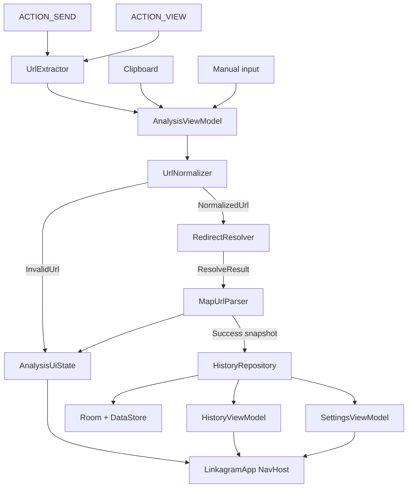

# Linkagram architecture

Single Gradle module (`:app`) with package-level boundaries. The rationale for
one module is in [ADR-001](decisions/ADR-001-android-project-structure.md).

## Packages

```text
io.github.miksask.linkagram/
├── LinkagramApplication / AppContainer
├── core/
│   ├── clipboard/   ClipboardUrlReader
│   ├── time/        HistoryDateRangeCalculator
│   └── url/         UrlNormalizer, UrlExtractor, SearchNormalizer
├── data/
│   ├── history/     Room DB, DAO, HistoryRepository, DataStore settings
│   ├── maps/        MapUrlParser + one parser per provider
│   └── resolver/    RedirectResolver — manual HTTP redirect following
├── domain/          LocationInfo, ResolveResult, HistoryEntry, formatters
└── ui/
    ├── analysis/    AnalysisScreen, AnalysisViewModel
    ├── history/     HistoryScreen, HistoryDetailsScreen, ViewModels
    ├── settings/    SettingsScreen, SettingsViewModel
    ├── navigation/  Destinations
    ├── common/      UrlDisplay helpers
    └── theme/       Material 3 colour scheme
```

## Data flow



## Rules

- The UI layer contains no URL processing or SQL; it renders immutable UI state.
- `RedirectResolver`, map parsers, and history date/search helpers stay free of
  Compose so they are unit-testable on the JVM.
- Map parsers never perform network requests. They parse the final URL only.
- `HistoryRepository` / `HistorySettingsRepository` are the only justified
  data-access seams for Spec 006. No DI framework; `AppContainer` holds
  singletons and ViewModel factories.
- Results and errors are sealed types rather than nullable values.
- Network and database work run off the main thread.

## Dependency seams

```kotlin
class AnalysisViewModel(
    private val resolveUrl: suspend (String) -> ResolveResult = RedirectResolver()::resolve,
    private val mapUrlParser: MapUrlParser = MapUrlParser(),
    private val historyRepository: HistoryRepository? = null,
    private val ioDispatcher: CoroutineDispatcher = Dispatchers.IO,
)
```

Production wiring uses `LinkagramApplication.container` and ViewModel
`Factory` classes. Tests substitute fakes and test dispatchers.

## Networking and persistence

One `OkHttpClient` per resolver instance, with automatic redirects disabled.
See [ADR-002](decisions/ADR-002-url-resolution.md),
[ADR-003](decisions/ADR-003-http-client.md), and
[ADR-004](decisions/ADR-004-privacy-and-networking.md).

Local history uses Room 2.8.4 + Preferences DataStore; see
[ADR-006](decisions/ADR-006-local-analysis-history-storage.md). History files are
excluded from cloud backup and device transfer.
