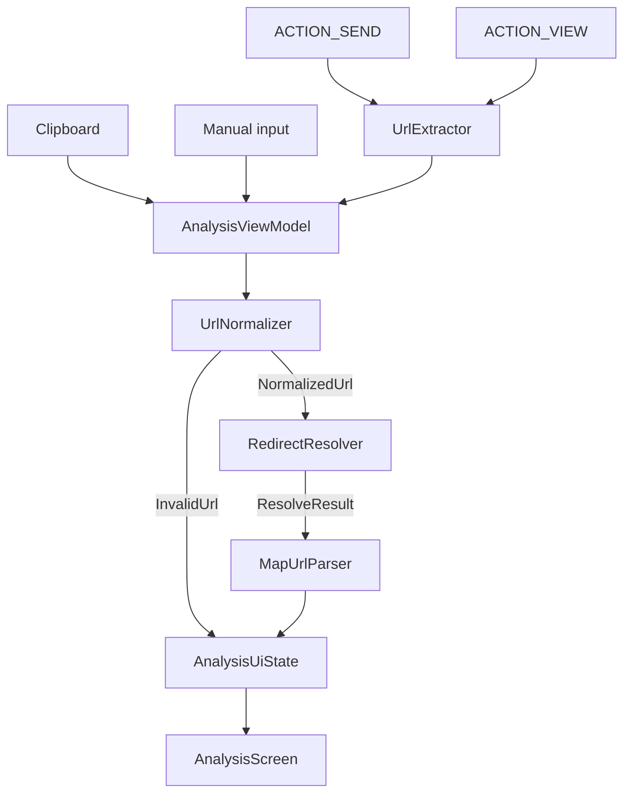

# Linkagram architecture

Single Gradle module (`:app`) with package-level boundaries. The rationale for
one module is in [ADR-001](decisions/ADR-001-android-project-structure.md).

## Packages

```text
io.github.miksask.linkagram/
├── core/
│   ├── clipboard/   ClipboardUrlReader — reads text from the system clipboard
│   └── url/         UrlNormalizer, UrlExtractor — pure JVM URL handling
├── data/
│   ├── maps/        MapUrlParser + one parser per provider
│   └── resolver/    RedirectResolver — manual HTTP redirect following
├── domain/          LocationInfo, ResolveResult, MapParseResult, formatters
└── ui/
    ├── analysis/    AnalysisScreen, AnalysisViewModel, AnalysisUiState
    └── theme/       Material 3 colour scheme
```

## Data flow



## Rules

- The UI layer contains no URL processing logic; it renders `AnalysisUiState`.
- `RedirectResolver` and the map parsers do not depend on Compose or Android
  UI types, so they are unit-testable on the JVM.
- Map parsers never perform network requests. They parse the final URL only.
- Provider-specific parsing lives in one class per provider under `data/maps/`.
- Results and errors are sealed types (`ResolveResult`, `MapParseResult`,
  `UrlNormalizationResult`) rather than nullable values.
- `AnalysisUiState` is an immutable data class exposed through `StateFlow`.
- Network work runs off the main thread and is cancellation-aware: cancelling
  the analysis coroutine cancels the in-flight OkHttp call.

## Dependency seams

`AnalysisViewModel` takes its collaborators as constructor parameters with
production defaults:

```kotlin
class AnalysisViewModel(
    private val resolveUrl: suspend (String) -> ResolveResult = RedirectResolver()::resolve,
    private val mapUrlParser: MapUrlParser = MapUrlParser(),
    private val ioDispatcher: CoroutineDispatcher = Dispatchers.IO,
)
```

Tests substitute a fake resolver and a test dispatcher. This is deliberate in
place of a DI framework, which the project does not need at this size.

## Networking

One `OkHttpClient` per resolver instance, with automatic redirects disabled and
connect/read/call timeouts. See [ADR-002](decisions/ADR-002-url-resolution.md),
[ADR-003](decisions/ADR-003-http-client.md), and
[ADR-004](decisions/ADR-004-privacy-and-networking.md).
